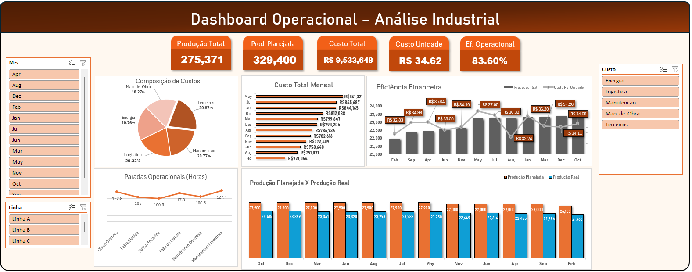
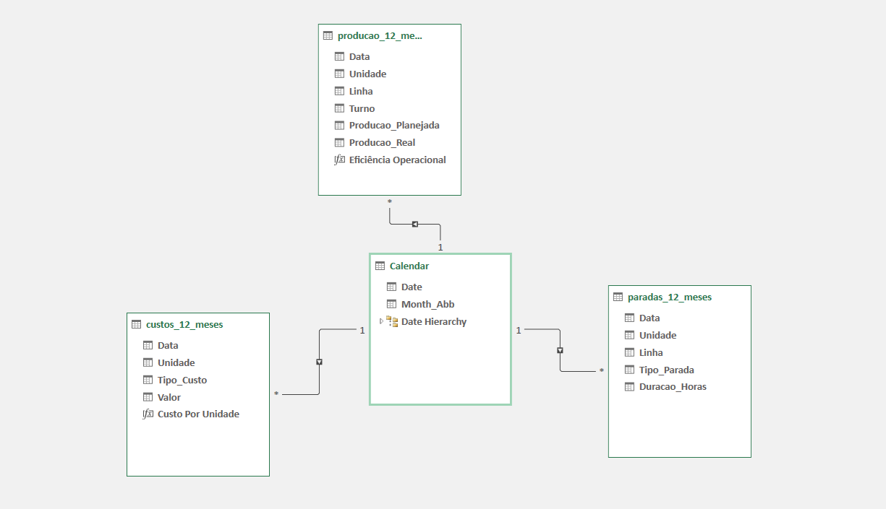
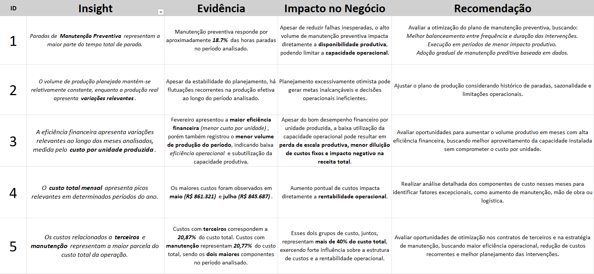

# Análise Operacional Industrial

Projeto de análise de dados desenvolvido em **Excel**, utilizando **Power Query**, **Power Pivot**, **Modelagem de Dados Relacional** e **Dashboards interativos**, simulando um cenário real de uma operação industrial.

O objetivo do projeto é transformar dados operacionais em **insights acionáveis para apoio à tomada de decisão gerencial**.

---

## Objetivo do Projeto

Analisar o desempenho operacional ao longo de **12 meses**, com foco em:

- Comparação entre **Produção Planejada e Produção Real**
- Identificação dos **principais direcionadores de custo**
- Avaliação do impacto das **paradas operacionais**
- Análise de **eficiência financeira** e **eficiência operacional**

---

## Ferramentas Utilizadas

- Microsoft Excel  
- Power Query (ETL e tratamento de dados)  
- Power Pivot (modelagem de dados e medidas em DAX)  
- Tabelas dinâmicas e gráficos dinâmicos  
- Dashboards interativos  

---

## Dashboard Executivo

O dashboard foi desenvolvido com foco em **análise gerencial**, priorizando clareza visual, consistência de métricas e facilidade de interpretação.

**Principais elementos do dashboard:**
- KPIs consolidados no topo
- Análise mensal de produção e custos
- Comparação entre produção planejada e produção real
- Composição dos custos operacionais
- Análise de paradas operacionais
- Segmentações de dados (mês, linha e tipo de parada)

---

## Modelagem de Dados

O projeto utiliza **modelo em estrela**, garantindo consistência analítica, escalabilidade e correto funcionamento dos filtros e métricas no Power Pivot.

### Relacionamentos no Power Pivot

**Relacionamentos implementados:**
- Calendar (1) → Produção (*)
- Calendar (1) → Custos (*)
- Calendar (1) → Paradas (*)

A tabela **Calendar** centraliza toda a análise temporal, evitando duplicidade de colunas de data nas tabelas fato e assegurando padronização das análises ao longo do tempo.

---

## KPIs

Principais indicadores utilizados na análise:

- Produção Planejada
- Produção Real
- Custo Total
- Custo por Unidade (**Eficiência Financeira**)
- Eficiência Operacional (%)

**Definições adotadas:**
- **Eficiência financeira:** quanto menor o custo por unidade, maior a eficiência
- **Eficiência operacional:** maior aderência entre a produção real e a produção planejada

---

## Insights de Negócio

Os dados foram analisados e traduzidos em **insights estratégicos**, com foco na identificação de oportunidades de melhoria operacional e redução de custos.

